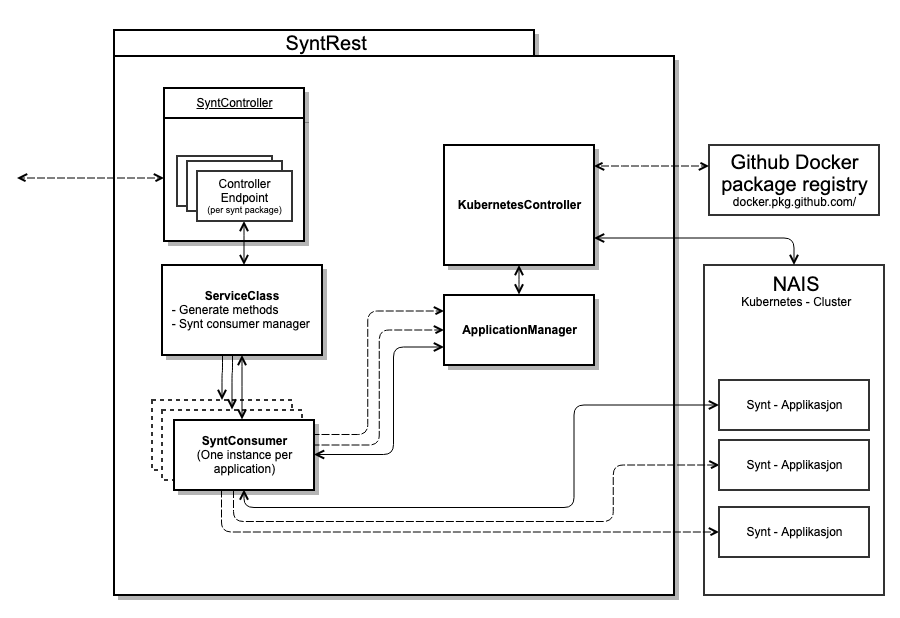

# SyntRest API
Syntrest kontrollerer start og stopp av de forskjellige synt-pakkene på NAIS.

## Hvorfor et eget SyntRest lag?
Mange av maskinlærings-modellene for syntetisering av ulike miljøer tar opptil flere Gb med lagringsplass. 
Dette har vist seg vanskelig å senke, siden det i [BeAn](#) brukes tredjeparts-biblioteker (scikit-learn) med ferdige 
moduler som tar opp plass. 

Når en applikasjon deployes på kubernetes-clusteret til NAIS spesifiserer man minimum påkrevd minne, slik at 
applikasjonen alltid vil kreve minst så mye ressurser av clusteret så lenge den kjører. 
Siden generering av syntetiske testdata kun skjer når det blir gjort et kall til en synt-applikasjon, er det klart at 
disse synt-appliakasjonene ikke trenger å være oppe og kjøre på clusteret hele tiden (og ta opp unødvendige ressurser). 

Løsningen på dette problemet er en egen SyntRest-applikasjon som dynamisk deployer og fjerner synt-applikasjoner 
"on the fly" etter behov, i tillegg til å være applikasjonen man gjør alle api-kall til, siden de blir routet videre 
til endepunkter i synt-applikasjonene.

## Struktur

Consumere gjør kall til SyntController endepunktene, som gjør enkel validering av input fra consumenten. 

De i sin tur kaller på en litt ukonvensjonell syntetisering-service. Den henter og manipulerer URL'er fra 
`application.properties` ettersom hvilken synt-pakke man kaller på og innholdet i kallet. Den klargjør da også selve 
request'en vi vil sende til synt-pakken, siden dette kan være litt forskjellig fra pakke til pakke. 

Deretter blir den klargjorte requesten sendt til den aktuelle synt-consumeren som blir opprettet av SyntConsumerManager.

SyntConsumer sørger sjekker om applikasjonen finnes på NAIS gjennom ApplicationManager (som igjen spør 
kubernetesController, siden denne kjører kubectl kommandoer på clusteret). Dersom den ikke finnes, starter 
Application manager en ny innstanse av pakken, som syntConsumeren kobler seg på.

Hver gang en synt-pakke blir aksessert gjennom ApplicationManager tar den eierskap for pakken og slår den av 5min
etter siste kall til pakken. Pakker som blir startet av andre prosesser blir ikke rørt av ApplicationManager inntil 
noen aksesserer den aktuelle pakken gjennom denne.

SyntConsumer gjør så selve utvekslingen mot synt-pakken og returnerer de syntetiske verdiene.

## Hvordan legge til Synt-Pakker
De filene som må endres når man legger til synt-pakkene er:

 - [SyntController](src/main/java/no/nav/registre/syntrest/controllers/SyntController.java)
   - Nytt endepunkt for SyntRest
 - [SyntetiseringService](src/main/java/no/nav/registre/syntrest/services/SyntetiseringService.java)
   - Generer kallet for consumerManager
   - Noen generiske metoder er laget for request-typer som blir brukt ofte
 - [SyntConsumerManager](src/main/java/no/nav/registre/syntrest/consumer/SyntConsumerManager.java)
   - Legger til en ny konsument av den nye synt-pakke typen
 - [application.properties](src/main/resources/application.properties)
   - Lenke til nais-applikasjonen som blir startet (ingressen i nais-yaml'en)
 - [NAIS-fil](src/main/resources/nais)
   - NAIS yaml for den nye pakken. Navngivningskonvensjon {appName}.yaml
 - [SyntAppNames](src/main/java/no/nav/registre/syntrest/utils/SyntAppNames.java)
 - Evt. legge til klasser for spesifiserte [Respons-meldinger](src/main/java/no/nav/registre/syntrest/response).
 
## TODOs
 - [ ] 
 - [ ]