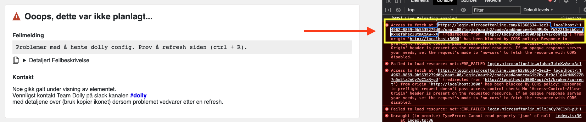
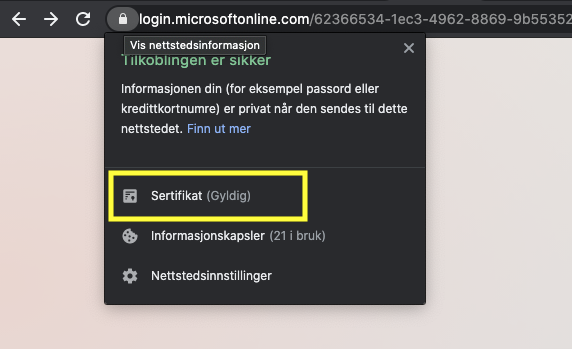
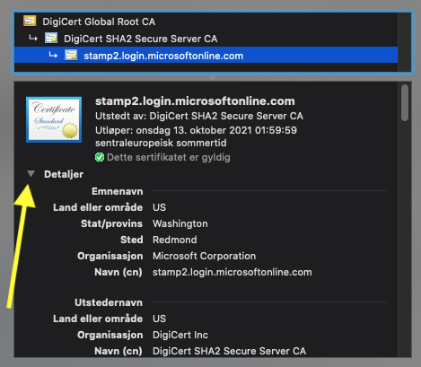
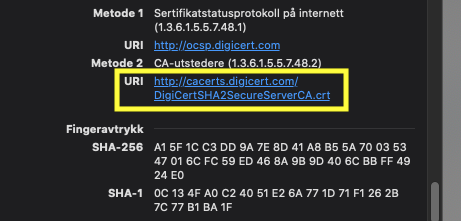

[](https://sonarcloud.io/dashboard?id=navikt_dolly-frontend)


# Dolly
Prosjekt for å opprette og konfigurere testpersoner knyttet til fellesregistrene i NAV.

## Dokumentasjon
### Swagger
Swagger finnes under /swagger-ui.html

## Lokal kjøring

#### Javascript
- Følg oppskriften i Java, denne kreves for å kjøre Dolly lokalt
- Kjør applikasjonen med npm start (fra ./src/main/web_src)
    - Default browser åpner automatisk et vindu til localhost:3000, hvor du vil bli møtt av en feilmelding
    - Åpne konsollen og klikk på linken som ligger øverst i konsollen
        - Åpne konsoll i *Chrome - **Mac:** Command + Option + J, **Win:** Control + Shift + J*
        - Åpne konsoll i *Firefox - **Mac:** - Command + Option + K, **Win:** Control + Shift + K*
        
    - En ny fane åpnes med informasjon tilknyttet din konto, denne fanen kan deretter lukkes
- Du vil nå være logget inn i den første fanen (prøv en refresh dersom det ikke fungerer med en gang) og kan begynne å bruke Dolly lokalt


**NB: Legg til i .npmrc filen for å kjøre fra utv image**

```
https-proxy=http://155.55.60.117:8088/
proxy=http://155.55.60.117:8088/
registry=http://registry.npmjs.org/
no-proxy=*.adeo.no
strict-ssl=false
```

#### Java
For å kjøre lokalt (ApplicationStarter) må active profile settes til `dev`. I tillegg, for å kunne gjøre kall mot NAIS apper må nav 
truststore settes opp og cloud vault token må hentes fra Vault. Vault token hentes ved at man logger inn i Vault, 
trykker på nedtrekksmenyen oppe til høyre, og trykker på "Copy token".

Disse verdiene fylles deretter inn i VM Options på IDE:

Run -> Edit Configurations -> VM Options 

```
-Djavax.net.ssl.trustStore=C:\path\to\truststore
-Djavax.net.ssl.trustStorePassword=(Passord)
-Dspring.cloud.vault.token=(Copy token fra Vault)
-Dspring.profiles.active=dev
```

Hvis du også kjører Dolly-backend lokalt og vil teste Dolly mot den lokale backend versjonen så må `dolly.url` i application-local.yml 
settes til url-en for den lokale versjonen av dolly-backend (eks: `http://localhost:8080`)


##### Legge til sertifikat i truststore:
Dersom det dukker opp RunTimeException under oppstart kan det være at du mangler sertifikat i din truststore.

Sertifikat kan hentes fra [Microsoft Login Cert](https://login.microsoftonline.com/62366534-1ec3-4962-8869-9b5535279d0b/login) (Ignorer feilmeldingen om POST)

For Mac:
- Trykk på hengelåsen til venstre for URL og klikk deretter på sertifikat

 

- Klikk på pilen ved siden av detaljer og bla helt ned

 

- Ved å trykke på linken vil sertifikat lastes ned og man kan deretter legge denne til i Truststore ved hjelp av kommandoen:
```
keytool -import -trustcacerts -alias MicrosoftLoginCert -file DIN_DOWNLOAD_DIR/DigiCertSHA2SecureServerCA.crt -keystore PATH_TIL_DIN_KEYSTORE.jts
```

 

##### Bygge med maven utenfor utviklerimage:

**NB: `Naisdevice` må kjøre**

Legg inn dette i **din** maven settings.xml fil:
```
<settings>
    <profiles>
        <profile>
            <activation>
                <activeByDefault>true</activeByDefault>
            </activation>
            <repositories>
                <repository>
                    <id>internal-mirror-github-navikt</id>
                    <url>https://repo.adeo.no/repository/github-package-registry-navikt/</url>
                </repository>
            </repositories>
        </profile>
    </profiles>
</settings>
```
