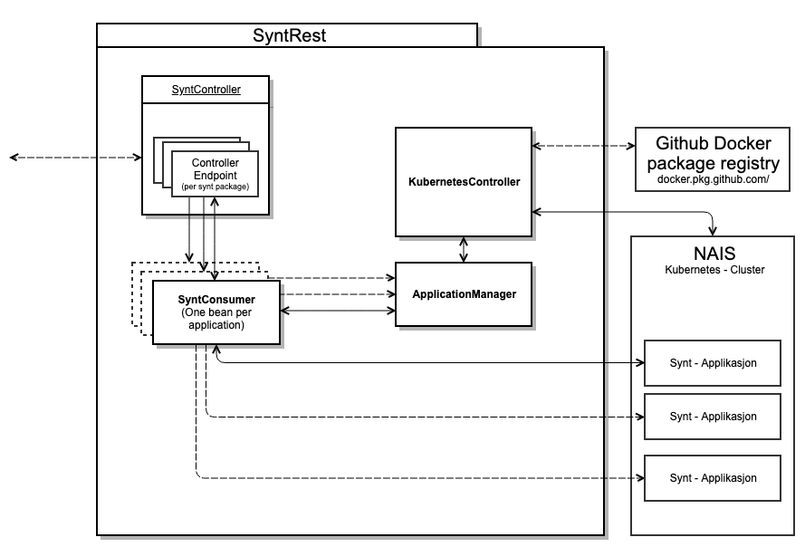

# SyntRest API
Syntrest kontrollerer start og stopp av de forskjellige synt-pakkene på NAIS.

## Hvorfor et eget SyntRest lag?
Mange av maskinlærings-modellene for syntetisering av ulike miljøer tar opptil flere Gb med lagringsplass. 
Dette har vist seg vanskelig å senke, siden det i [BeAn](#) brukes tredjeparts-biblioteker (scikit-learn) med ferdige 
moduler som tar opp plass. 

Når en applikasjon deployes på kubernetes-clusteret til NAIS spesifiserer man minimum påkrevd minne, slik at 
applikasjonen alltid vil kreve minst så mye ressurser av clusteret så lenge den kjører. 
Siden generering av syntetiske testdata kun skjer når det blir gjort et kall til en synt-applikasjon, er det klart at 
disse synt-appliakasjonene ikke trenger å være oppe og kjøre på clusteret hele tiden (og ta opp unødvendige ressurser). 

Løsningen på dette problemet er en egen SyntRest-applikasjon som dynamisk deployer og fjerner synt-applikasjoner 
"on the fly" etter behov, i tillegg til å være applikasjonen man gjør alle api-kall til, siden de blir routet videre 
til endepunkter i synt-applikasjonene.

## Struktur


Konsumenter gjør kall til SyntController endepunktene, som gjør enkel validering av input fra consumenten. 

I denne applikasjonen har vi valgt å droppe service-laget, da ingen business-logikk vil bli gjort der. URL'er for hver 
python-synt-applikasjon blir definert direkte i controller-laget, men blir lagret i `application.properties`. Vi kaller 
deretter direkte på forskjellige bønner av SyntConsumer klassen.

SyntConsumer sjekker om applikasjonen finnes på NAIS gjennom ApplicationManager (som igjen spør 
kubernetesController, siden denne kjører kubectl kommandoer på clusteret). Dersom den ikke finnes, starter 
Application manager en ny innstanse av pakken, som syntConsumeren kobler seg på.

Hver gang en synt-pakke blir aksessert gjennom ApplicationManager tar den eierskap for pakken, og slår den av 5min
etter siste kall til pakken (lengden på denne tiden blir styrt gjennom `synth-package-unused-uptime` i .properties filen 
for den kjørende profilen). 
Pakker som blir startet av andre prosesser blir ikke rørt av ApplicationManager inntil noen aksesserer den aktuelle 
pakken gjennom denne.

SyntConsumer gjør så selve utvekslingen mot synt-pakken og returnerer de syntetiske verdiene.

## Hvordan legge til Synt-Pakker
De filene som må endres når man legger til synt-pakkene er:

 - [SyntController](src/main/java/no/nav/registre/syntrest/controllers/SyntController.java)
   - Legg til URL'en for din nye syntpakke
   - Nytt endepunkt for SyntRest
 - [AppConfig](src/main/java/no/nav/registre/syntrest/config/AppConfig.java)
   - Legg til en ny bean for ditt nye endepunkt, dersom det ikke er en del av en allerede eksisterende bean.
 - [application.properties](src/main/resources/application.properties)
   - Lenke til nais-applikasjonen som blir startet (ingressen i nais-yaml'en)
 - [NAIS-fil](src/main/resources/nais)
   - NAIS yaml for den nye pakken. Navngivningskonvensjon {appName}.yaml
 - Evt. legge til klasser for spesifiserte [domain-meldinger](src/main/java/no/nav/registre/syntrest/domain).
 - Legge til tester i [SyntControllerTest](src/test/java/no/nav/registre/syntrest/SyntControllerTest)
 
## Oversikt over synt-pakker
 - **Aareg**\
   _Genererer syntetiske arbeidshistorikker bestående av meldinger på AAREG format._
 - **Aap** 
   - **11_5**\
   _Generer et antall AAP11_5 meldinger_
   - **NyRettighet**\
   _Generer et antall nye rettigheter_
 - **Bisys**\
   _API for å generere syntetiserte bisysmeldinger._
 - **Inst**\
   _Generer et antall institusjonsforholdsmeldinger._
 - **Medl**\
   _Generer MEDL meldinger. For info om selve syntetiseringen og_
   _[datagrunnlag](https://confluence.adeo.no/display/FEL/Syntetisering+-+MEDL)._\
   _OBS! Veldig Treg!_
 - **Meldekort**\
   _Opprett et antall meldekort for meldegruppen_\
   _APIet genererer meldekort i XML format som kan settes inn i arena. Merk at denne metoden genererer kun bodyen til_
   _XML-meldingen til et meldekort, og er avhengig av å få satt på et hode for at denne kan legges inn i Arena._\
   \
   _Kernel density modellene blir generert ved førstegangs kjøring og lagret i postgresdatabasen,_
   _synthdata_register_syn. Hvis modellene skal trenes på nytt igjen og oppdateres må disse slettes fra_
   _postgresdatabasen og legges inn på nytt._\
   \
   _Merk at dette ikke er mulig med dagens NAIS oppsett da dette_
   _tar lang tid og applikasjonen timer ut. Dette må enten gjøres lokalt med samme python versjon som blir_
   _kjørt på NAIS (3.7.1 per dags dato), eller så må NAIS instillingene oppdateres._
 - **Nav**\
   _Opprett et antall meldinger med endringskode fra path variabelen._\
   _Returenterer en liste med strenger der hvert element er en endringsmelding-xml._
 - **Popp**\
   _Genererer syntetiske inntektsmeldinger til Sigrunstub._
   _Inntektsmeldingene blir returnert på et format som kan bli lagret i sigrunstub, og vil generere en ny_
   _inntektsmelding basert på personens inntektsmelding forrige år. Hvis personen ikke har en inntektsmelding_
   _vil det bli samplet en ny inntektsmelding fra en BeAn/CART-modell._
 - **Sam**\
   _API for å generere syntetiserte SAM data._
 - **Inntekt**\
   _Generer inntektsmeldinger på et map med fødselsnumre og_
   _inntektsmeldinger på samme format som i inntektstub. Hvis man legger ved en liste med inntektsmeldinger_
   _per fødselsnummer, (altså forrige måneds inntektsmelding) blir den nye inntektsmeldingen basert på disse._
   _Hvis man legger ved en tom liste til fødselsnummeret blir en inntektsmelding generert basert på en kernel_
   _density model._
 - **TP**\
   _Generer antall tjenestepensjonsmeldinger. For info om_
   _selve syntetiseringen av TP, se [her](https://confluence.adeo.no/display/FEL/Syntetisering+-+TP)_
 - **TPS**\
   _Lager SKD meldinger for ulike endringskoder_
 - **Frikort**\
   _Lager et spesifisert antall kvitteringer for hvert personnummersom sendes inn._
 - **Eia**\
   _Lager en legeerklæring for hvert objekt i forespørselen. Returnerer et map med_
   _key=personnummer for pasienten, value=xml for legeerklæringen_

## Lokal kjøring
Oppdater `kube-config-path` i `application-dev.properties` til din lokale kubeconfigs path.
Kjør så ApplicationStarter med følgende argumenter:

```
 -Djavax.net.ssl.trustStore=[path til lokal truststore]
 -Djavax.net.ssl.trustStorePassword=[passord til lokal truststore]
 -Dspring.profiles.active=dev
 -DGITHUB_USERNAME=[github brukernavn, kan finnes i syntrest secrets i vault]
 -DGITHUB_PASSWORD=[github passord, kan finnes i syntrest secrets i vault]
```
Utenfor utviklerimage er det unødvendig med `trustStore`.
Hvis ApplicationStarter ikke vil kjøre sjekk at du fremdeles har gyldig Kubectl token (`kubectl get pods` kommando fungerer lokalt.)

### Image tag - Deploye synt-applikasjoner lokalt
Når syntrest kjøres lokalt så klarer den ikke alltid å hente korrekt/siste image tag fra github for synt-applikasjon som skal deployes. 
En manuell fiks for dette er å gå til [packages](https://github.com/orgs/navikt/packages?repo_name=testnorge-syntetiseringspakker) og hente siste versjon for ønsket 
applikasjon og bytte ut `latest` med denne versjonen i image-delen i relevant nais.yaml (resources/nais/{app-name}.yaml). Deretter må følgende kode kommenteres ut i 
`KubernetesController` `prepareYaml`-metode:
```
Map<String, Object> spec = (Map) manifestFile.get("spec");
String imageBase = spec.get("image").toString();
String latestImage = imageBase.replace("latest", getApplicationTag(appName).orElse("latest"));
spec.put("image", latestImage);
```

NB: Pass på at denne manuelle fiksen ikke pushes til master.

## Kubeconfig
I vault er det lagret en kubeconfig fil som syntrest bruker til å kunne deploye/shutdown appene. Hvis denne filen må 
lages på nytt må dette gjøres for team synt.