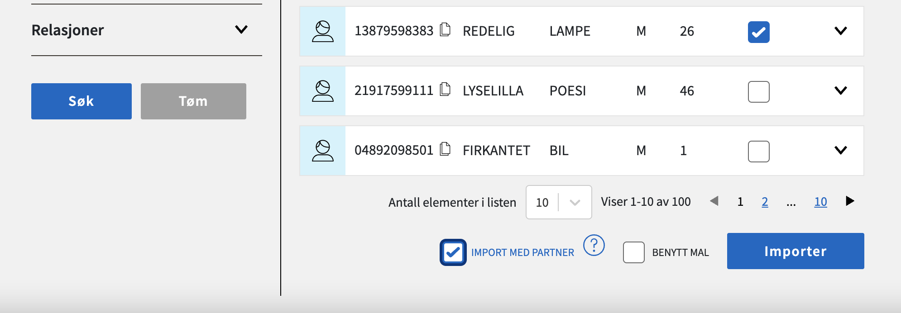

[← Til Dolly oversikt](index) | [Brukerveiledning](brukerveiledning) | [Retningslinjer](retningslinjer) | [Åpen kildekode](github)

Test-Norge er en felles offentlig testdatapopulasjon, som ble laget av Skatteetaten i
forbindelse med nytt folkeregister. Populasjonen er levende, og endrer seg fortløpende ved
at personer fødes, dør, får barn, osv. Populasjonen har syntetiske fnr/dnr hvor det er lagt til 80 på måned.
Hele Test-Norge populasjoen er tilgjengelig i PDL.

## Søk og import

Under "Test-Norge" fanen i Dolly er mulig å søke opp Test-Norge identer i Dolly, velge identer man ønsker å ta i bruk,
velge ekstra informasjon man ønsker lagt til på identene og importere dem inn i en ønsket gruppe i Dolly. Videon under
viser en demo for
hvordan dette kan gjøres.

<video src="https://user-images.githubusercontent.com/58416744/174292316-cc1b2c47-b855-4390-b77f-66bc8e426a39.mov" controls="controls" style="max-width: 730px;"></video>

For å finne mer spesifikke identer kan Skatteetaten sin
testdatasøkeløsning [Tenor](https://www.skatteetaten.no/skjema/testdata)
brukes. Tenor er ikke koblet opp mot Dolly, men det er mulig å søke opp identer du fant i Tenor via Dolly sin
søkeløsning og deretter importere dem til ønsket Dolly gruppe.

### Import av partner

Det er mulig å inkludere valgte personers partnere i import uten å velge dem på forhånd. Hvis valgt person har en
partner som ikke allerede er valgt for import kan man huke av for "IMPORT MED PARTNER" for å inkludere dem i importen.
Bilde under viser et tilfelle hvor import av partner er valgt.

Det er også mulig å importere partner etter opprinnelig import av person. Dette kan gjøres direkte i personvisning.
Videoen under viser en demo for dette.

<video src="https://user-images.githubusercontent.com/58416744/169964561-975783ea-3279-467b-8448-7aba3fecbac0.mov" controls="controls" style="max-width: 730px;" > </video>

NB: Når man frigjør/sletter en Test-norge person fra Dolly så vil også eventuell importert partner også bli
frigjort/slettet fra Dolly.

### ID-Porten

Vi anbefaler bruk av TestID når man skal teste ID-porten ved bruk av importert Test-Norge-ident.

[Til toppen](#test-norge) • [Dolly oversikt](index) • [Brukerveiledning](brukerveiledning) • [Retningslinjer](retningslinjer) • [Åpen kildekode](github)
