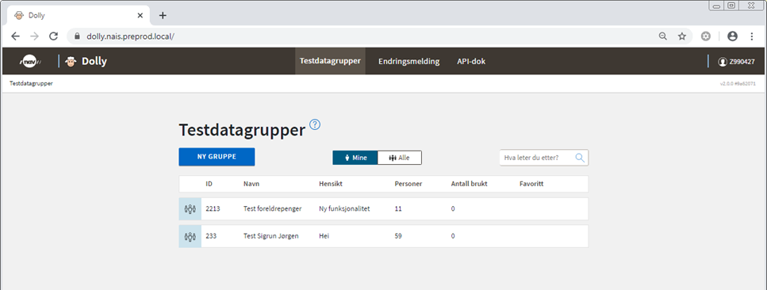
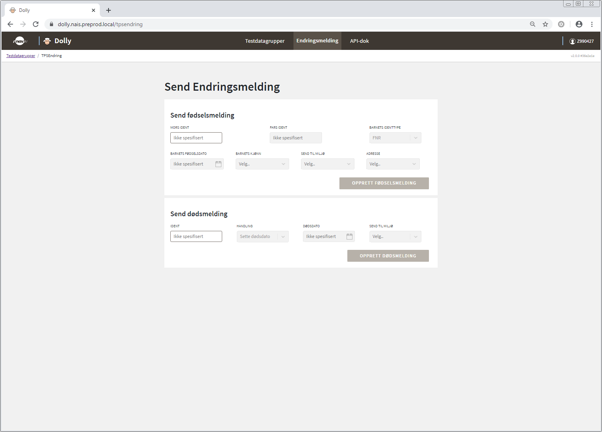
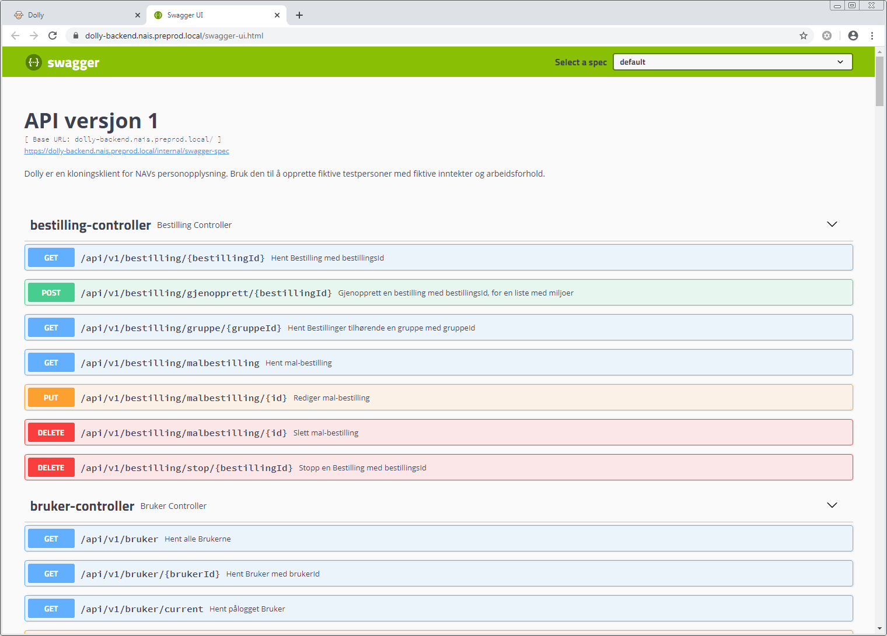

# {{ page.title }}

## Innhold
{: .no_toc .text-delta }

1. TOC {:toc}

Dolly er NAVs selvbetjeningsløsning for å opprette syntetiske testdata.  I Dolly kan du opprette syntetiske testpersoner med forskjellige egenskaper, og tilgjengeliggjøre testdataene i valgte testmiljøer.

Fra utviklerimage eller Citrix benytt lenken: 

[dolly.nais.preprod.local](https://dolly.nais.preprod.local/)

Utenfor de interne Nav systemene benytt: 

[dolly.nais-dev-fss.adeo.no](https://dolly.nais-dev-fss.adeo.no/)

Denne lenken krever tilgangen "Utvikling på laptop"

## Dolly pålogging 

For å logge inn i Dolly trenger du en Z-bruker. Detaljert beskrivelse av hvordan du kan opprette en Z-bruker, samt logge inn i Dolly finner du her: [Hvordan opprette Z-bruker](https://confluence.adeo.no/pages/viewpage.action?pageId=333640780)

Det første som møter deg når du har logget inn er en startside med noen menyvalg. Siden åpnes automatisk med en oversikt over dine testdatagrupper

## Opprette en ny testdatagruppe

For å opprette nye syntetiske testpersoner i Dolly, så kan du enten lage en ny testdatagruppe eller legge til testpersoner i en eksisterende gruppe. En testdatagruppe inneholder testpersoner du/teamet har opprettet.

Under ‘Mine’ vises testdatagrupper opprettet av deg selv. Under ‘Alle’ vises dine og andres testdatagrupper. En god regel er at du ikke endrer andres testdatagrupper uten avtale med eieren.

Trykk på "ny gruppe" og velg navn og beskriv gjerne hensikten med gruppen. Når hensikten er beskrevet er det enklere for både deg selv og eventuelt andre du samarbeider med å forstå hva denne testdatagruppen brukes til. Trykk "Opprett og gå til gruppe".

Inne på gruppen har du en oversikt over alle testpersonene som tilhører gruppen og hvilke egenskaper de har. Her har du også mulighet til å legge til nye testpersoner.

Det kommer opp en boks der du får to valg:

1. Opprette helt nye testpersoner. Da finner Dolly et ubrukt fnr, dnr eller bost.
2. Opprette fra eksisterende fnr, dnr eller Bost (identifikasjonsnummer kan ikke finnes i prod eller i Dolly).

Vi velger å opprette nye og angir at vi ønsker 10 personer i bestillingen.

Opprettelse av testpersoner følger en prosess med tre steg: 

1. Først må du velge hvilke egenskaper du selv ønsker å bestemme. De resterende egenskapene vil systemet tilegne for deg
2. Deretter får du mulighet til å angi verdier på egenskapene du valgte i steg 1
3. Til slutt får du en oppsummering og mulighet til å velge hvilke(t) testmiljø testpersonene skal sendes til

### Velg egenskaper

Som du ser av skjermbildet over, så er det en lang rekke områder med egenskaper du kan velge. Trykk på pil ned til høyre i boksen for å ekspandere hvert område. I de fleste tilfellene er det kun noen utvalgte egenskaper som er nødvendig å definere for det eller de testscenariene du skal gjennomføre.
For at du skal slippe å velge alle egenskaper som trengs for å få en komplett testperson vil Dolly tildele verdier til de egenskapene som ikke er avgjørende for din test, altså de du ikke krysser av for i skjermbildet. 

I dette eksemplet ønsker vi å teste endringer i arbeidsforhold og krysser av for følgende egenskaper: 

Team Dolly jobber kontinuerlig med videreutvikling av Dolly og nye egenskaper legges til fortløpende. Om det er noe du savner, så meld det inn på [#Dolly](https://nav-it.slack.com/archives/CA3P9NGA2) på Slack. 

Når du har angitt aktuelle verdier for egenskapene trykk videre og i neste steg får du mulighet til å velge hvilke(t) miljø testpersonene skal opprettes i. 

For mer informasjon om NAVs testmiljøer se: [Miljøer](https://confluence.adeo.no/pages/viewpage.action?pageId=305341700)

Velg miljø og trykk opprett

Testdatagruppen har fått nye testpersoner og du kan jobbe med disse i relevante fagsystemer.  Trykk på pil ned til høyre på raden for å få opp detaljinformasjon om hver enkelt testperson. 

## Opprette og bruke maler

Når du oppretter en ny person i Dolly kan du velge å lagre denne bestillingen som en mal. Denne malen kan senere hentes opp av deg selv eller andre, og vil gi deg en ferdigutfylt bestilling med de samme egenskapene og verdiene.

For å lage en mal av en bestilling huker du av for «Lagre som mal» på siste steg i bestillingsprosessen. Gi malen et beskrivende navn, så den er lett å finne tilbake til senere.

For å bruke en mal, velger du dette i første steg når du oppretter personer. Huk av for «Maler», og velg om du ønsker å bruke en av dine egne maler eller en annen brukers mal. Du vil da få opp en liste med alle malene denne brukeren har laget. Det vil for eksempel si at om en person på teamet ditt har laget en mal du ønsker å bruke, velger du først personens brukernavn og deretter malen du ønsker å bruke.

Når du da starter bestillingen vil du få de valgte egenskapene og verdiene som utgangspunkt, men du har også muligheten til å endre på disse dersom du ønsker det.

## Endringsmelding

Øverst i menyen kan du velge endringsmelding. Her har du mulighet til å sende inn en fødselsmelding eller dødsmelding til et ønsket testmiljø. Merk at det kun er mulig å sende inn endringsmelding på en person om gangen.

## API-dok

Øverst i menyen ligger også en lenke til API dokumentasjon. Den tar deg til Swagger og dokumentasjon av tilgjengelige APIer. 

