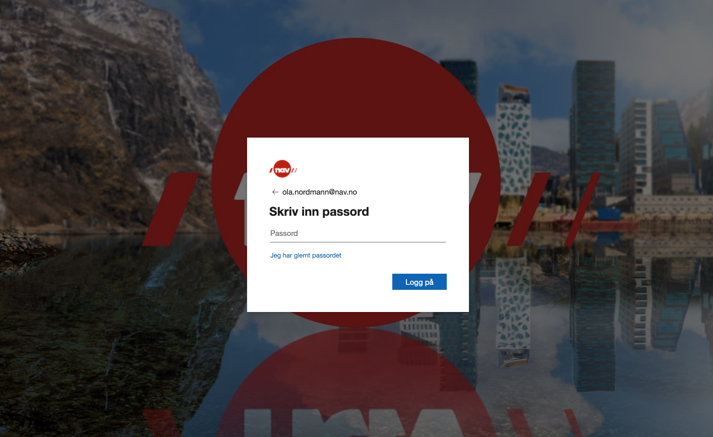

# {{ page.title }}

## Innhold
{: .no_toc .text-delta }

1. TOC
{:toc}

## Problemstilling

I dagens Dolly-applikasjon brukes Z-bruker opprettet via IDA-portalen til innlogging i Dolly. Dette er et system som er opprettet av NAV for å styre tilgangskontroll i NAV. Dolly har ikke det samme behovet i vårt system. Vi har ikke bruk for å bestemme tilgang til hvert enkelt system. (Det kan være vi skal skille mellom noen brukere, 
men da kun på funksjonalitet i Dolly, ikke enkelte underliggende systemer.)

Disse z-brukerne, fra vårt perspektiv, er ikke personligeere brukere. Vi henter ikke ut eiere og vi vet at de deles mellom personer i NAV. Derfor mister vi kontrollen på hvem som har opprettet brukeren. Prosessen for å opprette brukere er også kompleks (se [Hvordan opprette z-Bruker i dolly](https://navikt.github.io/dolly-frontend/z_bruker/). Dette betyr også at vi heller ikke kan gi personlige tilbakemelding dirkete fra Dolly.

Videre planene for Dolly er å kunne tilby eksterne brukere tilgang til Dolly. Med Z-bruker må vi også kunne dele ut til eksterne partnere, noe som jeg er svert usikker på at NAV ønsker. 

### freg-security

[repo: freg-security](https://github.com/navikt/freg-security)

Dette er en pakke som har blitt opprettet for å håndtere sikkerheten likt i Team Registre. Dette vil jeg anse som legacy og vi burde bytte til en fast standard for autentisering av brukere og endepunker.

## Løsnigsforslag

Løsingen vil være å vi ta i bruk AzureAD når vi skal håndtere innlogging til ansatte i NAV. Dette medfører at det blir samme innlogging som alle andre systemer med tilgangskontroll via AzureAD (mail, confluents, slack, osv..).



*Vi har også et behov for eksterene skal kunne få tilgang til Dolly. Da kan vi opprette gjestekontoer i Azure.*

### Implementasjon

Siden secrets i Azure ikke håndteres av Vault må vi brukere team namespace i kubernestes klusteret for de appene som som skal ha personlige sikkerhetsmekanismer. I praksis vil det bety at Dolly appene (frontend og backend) må ligge i dette namespacet. Noe som betyr at vi må bruke ingressene til andre apper utenfor (noe som kan medføre treghet). 

Får å støtte utviklermiljø og produksjon i samme namespace oppretter vi 4 apper i det namespace
```
dolly-frontend-dev
dolly-frontend-prod
dolly-backend-dev
dolly-backend-prod
```
(I fremtiden vil jeg legge alle våre apper i dette namespacet)

Det er kun Dolly frontend som skal håndtere innloggingen via AzureAd. Og Dolly backend tar imot access_tokens via [OAuth 2.0 On-Behaf-of]( https://docs.microsoft.com/en-us/azure/active-directory/develop/v2-oauth2-on-behalf-of-flow).

Med access_tokene, som brukes i kommunikasjon fra frontend til backend, vil backend kunne benytte epost eller annen personlig identifikator istedenfor Z-bruker
```
{
    aud: "<client_id for API B>",
    iss: "https://login.microsoftonline.com/<tenantId>/v2.0",
    iat: 1576661905,
    nbf: 1576661905,
    exp: 1576665803,
    aio: "AWQAm/8NAAAAHbiIIM5Vrln92W3Pm5faZMlUAtIpVuop0IkHR9Rnt8AwWd8uIyJHdFL01BcvbtBS8dbIk3WmKZ4M/fP/ToHZcwUPcrsNoH8Wae2LegEbLfLHAPN6QOBmFQ2mWTIj+MlH",
    azp: "<client_id på applikasjon hvor bruker logget inn>",
    azpacr: "1",
    name: "etternavn, fornavn",
    oid: "<unik id på brukeren i Azure AD>",
    preferred_username: "<fornavn.etternavn@maildome>",
    scp: "defaultaccess",
    sub: "<unik id på brukeren i kombinasjon med applikasjon det ble logget inn i>",
    tid: "966ac572-f5b7-4bbe-aa88-c76419c0f851",
    uti: "Tex7AFLWgUSfsZewtIgcAA",
    ver: "2.0"
}
```

Det betyr at vi kan bruke dagens mekanismer for å hente ut epost istedenfor for Z-bruker i Dolly. 

I Dolly frontend vil vi nå ha mulighet til å hente ut personlige informasjon om brukeren. Som epost, navn osv... som vil hjelpe oss til bedre feilsøkning, og være et steg i å kunne hjelpe personer utenfor NAV.

### Migererig fra Z-Bruker

I en periode vil vi legge til funksjonalitet for å kunne kopiere en Z-bruker over til din personlige bruker. På den måten vil ingen miste allerede opprettede brukere.

[Prototype](https://invis.io/ENXCGRI6XD8#/429665609_Innlogging_Personlig_ident_1)

## Ressurser
[https://security.labs.nais.io/](https://security.labs.nais.io/)