# {{ page.title }}

Bruk av Dolly selvbetjeningsløsning krever pålogging som testbruker - Z-bruker - med rettigheter gitt i verktøyet IDA. Disse testbrukerne kan tildeles andre og flere rettigheter enn man har med NAVIdenten i produksjon. Testerne kan på denne måten teste ny funksjonalitet i systemene med ulike roller og tilganger. 

Dolly kan du åpne fra fra utviklerimage/Citrix: https://dolly.nais.preprod.local/ 

eller direkte fra laptop: https://dolly.nais-dev-fss.adeo.no/

Brukerveiledning: [Kom i gang med Dolly](../index.md)

## Innhold
{: .no_toc .text-delta }

1. TOC
{:toc}

---
    
 
## Logge inn i Dolly

### Åpne Dolly på Laptop

1. Åpne Dolly i nettleseren ved å trykke på lenken: https://dolly.nais-dev-fss.adeo.no/ 

2. Logg på med AD-brukeren din (NAVident og passord)

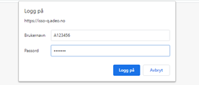

3. Deretter må du logge på med Z-bruker → se 1.3 for nærmere beskrivelse.

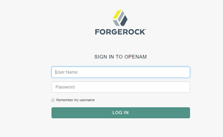

---

### Åpne Dolly fra utvikler image/Citrix
* Dolly åpnes i Chrome SKSS som du finner under "NAV Applikasjoner" 

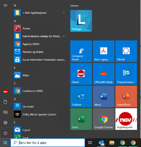

* Dolly kan også åpnes fra ‘VMWare View Client’ (Utviklerimage). 

* Velg nettleseren Chrome  fra startmenyen i ‘VMWare View Client’. Åpne ny fane i Chrome og legg inn URL.

---

### Pålogging
* Åpne Dolly i Chrome SKSS ved å trykke på lenken eller legg inn: https://dolly.nais.preprod.local/

* I påloggingsvinduet legger du inn Z-brukeren og passordet ditt

    * Se punkt 2 under for hvordan du oppretter en Z-bruker

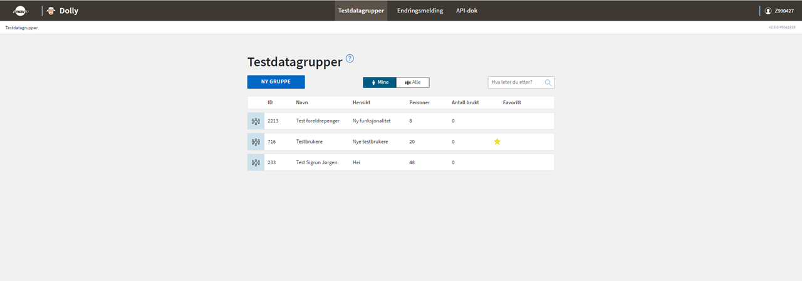
* Beskrivelse av hvordan du bruker Dolly finner du her: [Kom i gang med Dolly](../index.md)

---

## Opprette Z-bruker i IDA
For å kunne opprette en egen Z-bruker trenger du tilgang til IDA. Dette bestilles via identansvarlig for enheten du tilhører.  

Merk at for bruk av en Dolly-testperson i Gosys, må egne egenskaper legges på Z-bruker i IDA rutinen. Se nærmere beskrivelse under.

### Logg inn i IDA
1. Fra Chrome SKSS logg inn i IDA: https://ida.adeo.no/#/login

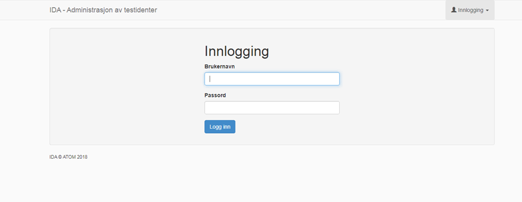

2. Legg inn 
    1. Brukernavn: din NAV brukerident
    2. Passord: ditt nav passord
    3. Trykk på "Logg inn"
3. Velg 'Nye identer'

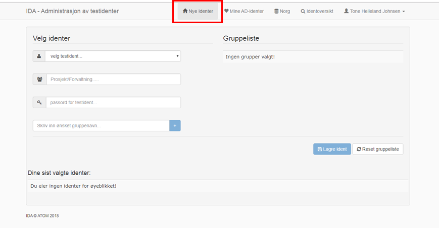

4. Velg testidenter → velg en av testidentene som vises i nedtrekkslisten

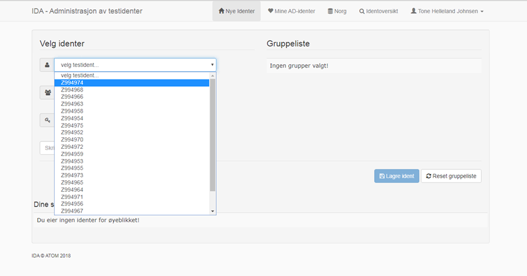

5. Prosjekt: Gi prosjektet ditt et navn. Min 3 og max 30 tegn. Store og små bokstaver, samt tall kan benyttes. Ingen spesialtegn eller mellomrom.

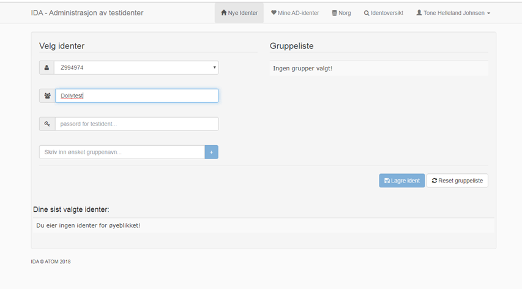

6. Passord: skriv inn ønsket passord for din Zident. Passordet må bestå av minst 8 tegn og må inneholde store og små bokstaver, samt tall.
7. Velg gruppenavn. Skriv inn: 0000-GA-TPSF-LES 
    1. Trykk på pluss-tegnet og gruppen legges under Gruppeliste
    

8. Trykk på «Lagre ident»

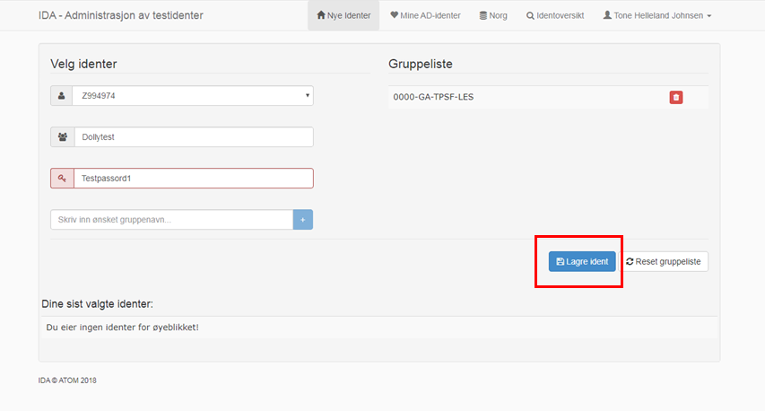

* Du har nå opprettet en Z-bruker som kan brukes til innlogging i Dolly (klar om ca.15 min)

---

### Opprette Z-bruker for test i Gosys
1. Logg inn og opprett ny ident som beskrevet i 2.1. Dersom du allerede har har en Z-bruker, kan nye grupper legges til ved å følge stegene beskrevet i pkt. 3 under. 
2. For å teste i Gosys må Z-brukeren din å være tilknyttet flere AD-grupper
    1. Velg de gruppenavnene du trenger og legg til ved å trykke på +

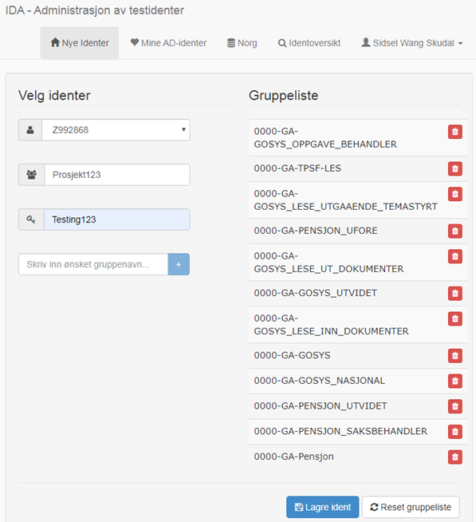

* Trykk på «Lagre ident» 

1. **Velg Norg**
    1. Velg Testmiljø: Q2 (eller et annet testmiljø)
    2. **VIKTIG!** Zidenten må også opprettes i Q1. Dette gjelder selv om du ikke skal bruke Q1. Se * 
    3. Huk av på Zidenten du har valgt tidligere og lagt inn grupper på: (f.eks. Z992868)
    4. Trykk på pil ‘>’ for å overføre Zidenten til ‘Mine Norg identer’

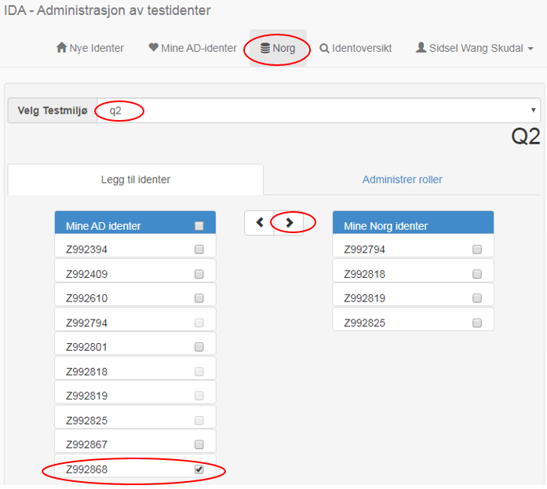

2.  Huk av for Zidenten under ‘Mine Norg identer’
3.  Velg ‘Administrer roller’

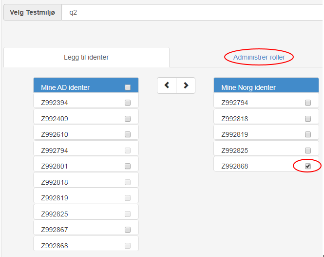

4. Legg Zidenten din inn i ‘Identer’ ( eks. Z992868)
5. Legg til Enheter
6. Legg til Roller 
7. Du kan skrive inn en og en rolle, eller trykk i feltet og hold enter knappen nede, da velges alle roller
8. Trykk ‘Lagre roller’
    1. Det tar ca. 15 min til Zidenten er klar til å brukes i f.eks. Dolly

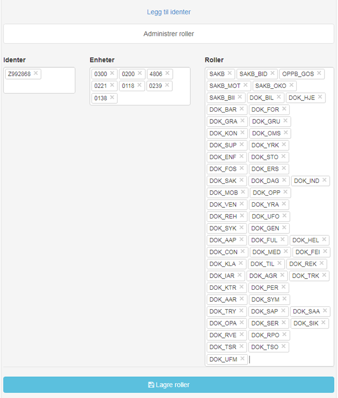

*   *...Autoriseringen går via ABAC og til AXSYS, som gjør valideringen i Q1. Zidenten legges inn i ønsket Q-miljø men må alltid i tillegg legges inn i Q1 miljøet, eller T1 hvis du jobber i T-miljøet. Alle ABAC miljøene i Q går mot AXSYS Q1. og ABAC miljøene i T går mot AXSYS T1. Slik får vi tilgang til å se genererte dokumenter i Gosys.

---

## Endre eksisterende Z-bruker
### Legge til Grupper
1. **Velg 'Mine AD-identer'**
2. Velg den Z-identen du vil ha grupper på og klikk på den

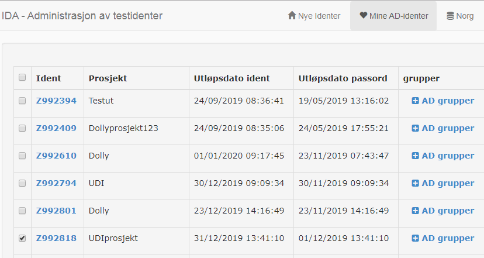

3. Skriv/legg inn ønskede grupper og trykk 'Legg til'

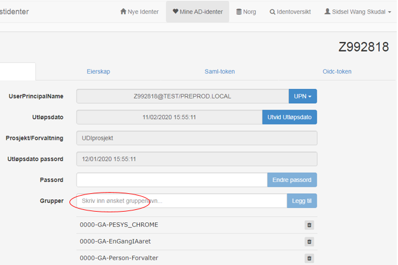

---

### Legge til Enheter og Roller
1. **Velg 'Norg'**
2. Huk av for den Z-identen du vil legge til Enheter på
3. Trykk 'Administrer roller'

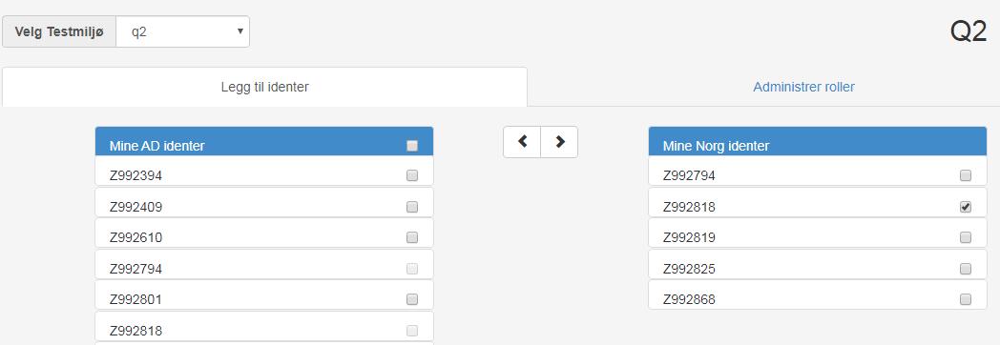

4. Skriv inn Z-idneten din i 'Identer'
5. Velg Enheter
6. Velg roller
7. Lagre roller

---

### Utvide utløpsdato for Z-bruker og passord
1. **Velg 'Mine AD-identer'**
    1 Velg den Z-identen du vil utvide utløpsdato for 
    

2. **Utvide utløpsdato for Z-ident**
    1 Trykk på 'Utvid Utløpsdato' og utløpsdatoen forlenges med ca. 2mnd 
    
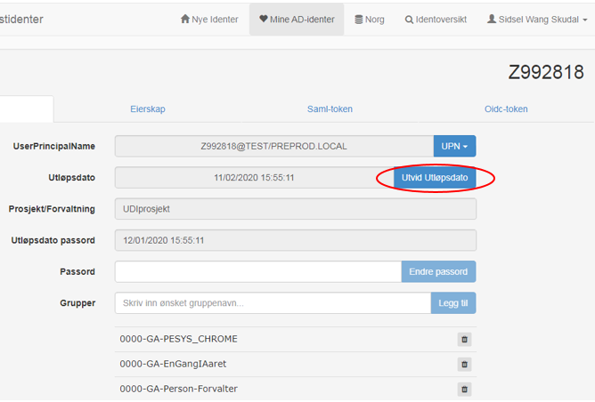

3. **Utvide passord for Z-ident**
    1 Skriv inn nytt passord og trykk på 'Endre passord'. Passordet forlenges med ca. 2mnd 

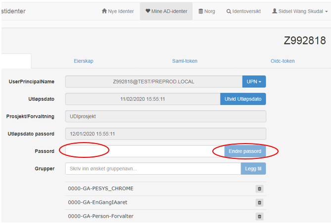

---

[Se i GitHub](https://github.com/navikt/dolly-frontend/){: .btn }